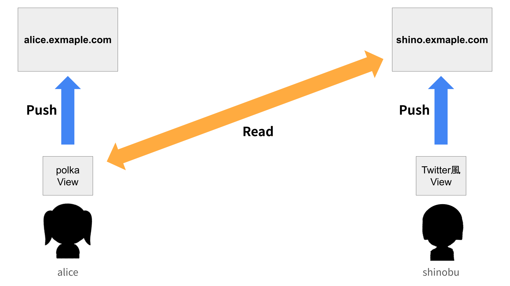
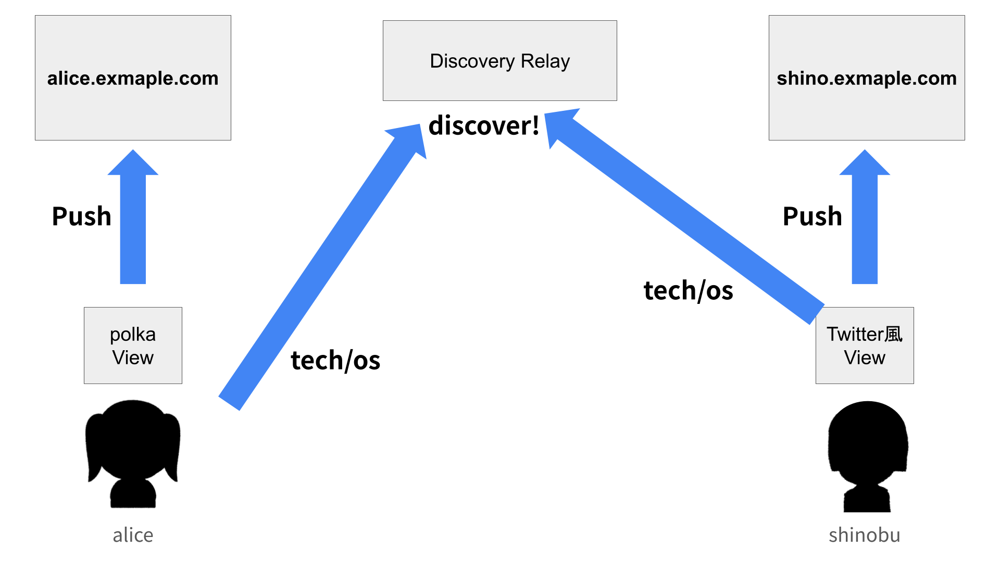

# ネットワークとユーザー発見

タグによる繋がりと、Nostrを利用した発見メカニズムです。

# ネットワークとユーザー発見

## タグによるグラフ構造
データはディレクトリ形式の階層構造で管理され、ユーザーは特定のパスをフォローすることで購読を行います。

```
📁 alice.example.com/
  └─ japan/
      ├─ kokeshi/
      │   └─ [投稿1, 投稿2, ...]
      └─ shinobu/
          └─ [投稿3, 投稿4, ...]
  └─ photo/
      └─ landscape/
          └─ [投稿5, 投稿6, ...]

📁 shino.example.com/
  └─ kinpatsu/
      ├─ alice/
      │   └─ [投稿7, 投稿8, ...]
      └─ karen/
          └─ [投稿9, 投稿10, ...]
```

*   **階層的な購読**: 
    *   `alice/japan/kokeshi` をフォロー：特定のカテゴリのみ取得。
    *   `alice/japan` をフォロー：配下の `kokeshi`, `shinobu` など全サブタグの投稿を網羅的に取得。
*   **コミュニティ形成**: 共通のタグが自然発生的に使用されることで、中央管理者のいない自律的な繋がりが生まれます。



## Nostrによるディスカバリ
ユーザー発見には、**Nostrリレー**を一時的なインフラとして活用します。



### タグ広告 (Kind 25565)
ユーザーは以下のスキーマを持つイベントをリレーに送信し、自身の存在を広告します。

| フィールド | 内容 |
| :--- | :--- |
| **kind** | 25565 |
| **content.did** | ユーザーの `did:web` |
| **content.bloom** | タグ配列を格納した **Bloom Filter** |

**Bloom Filter**を使用することで、タグの内容を完全に公開することなく、高速なマッチングが可能です。リレーを介してマッチングした後は、直接タグノードをフォローして繋がりを維持します。